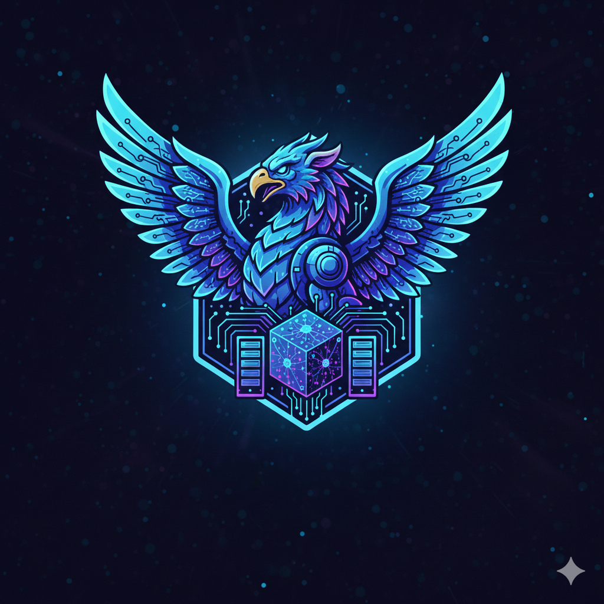
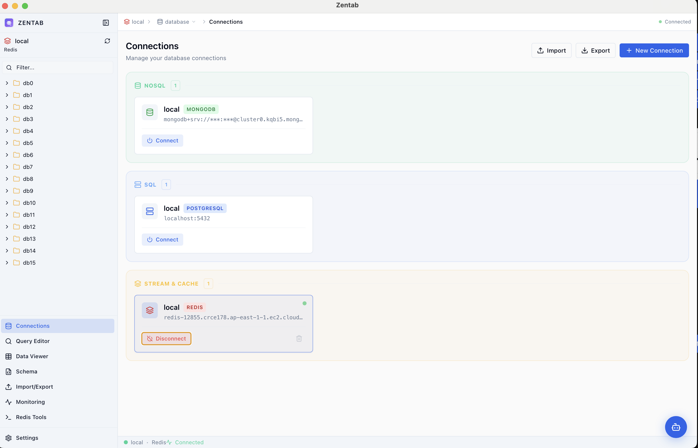
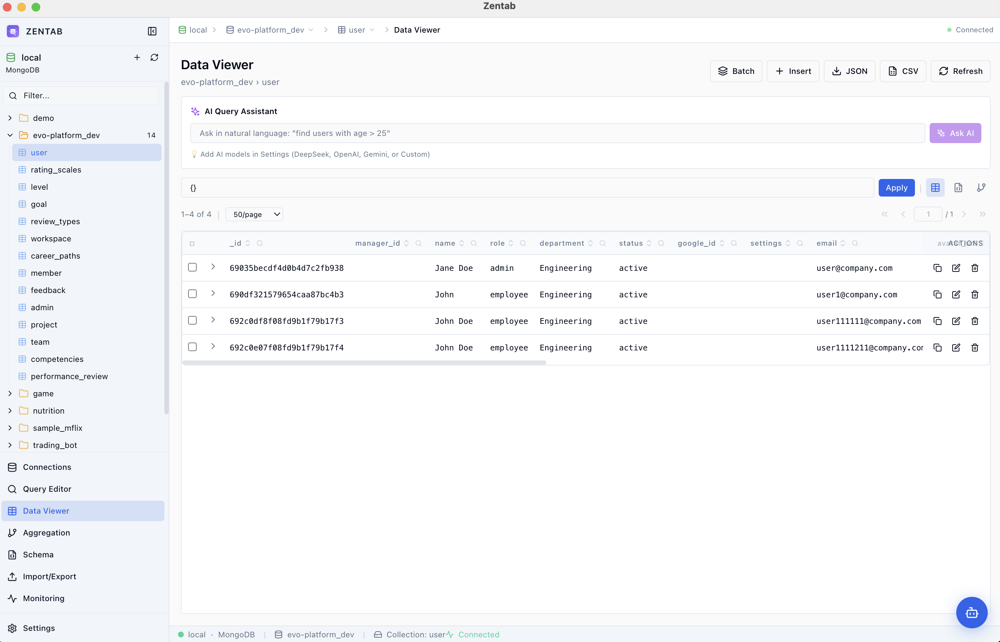
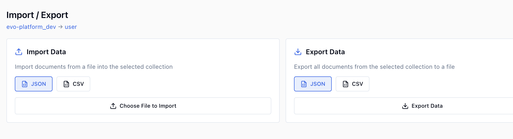
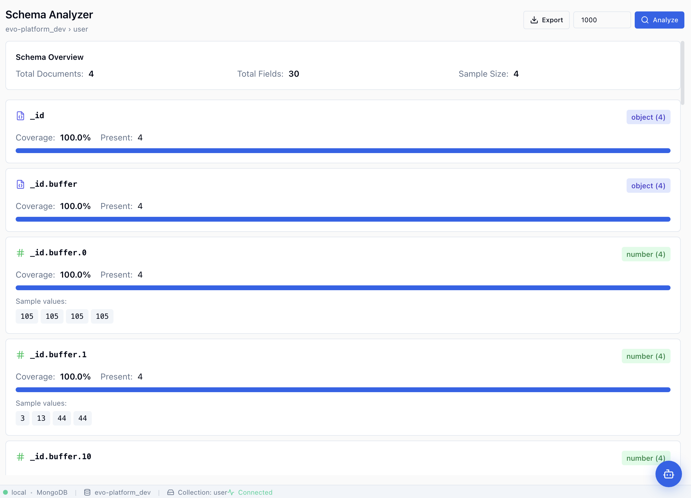
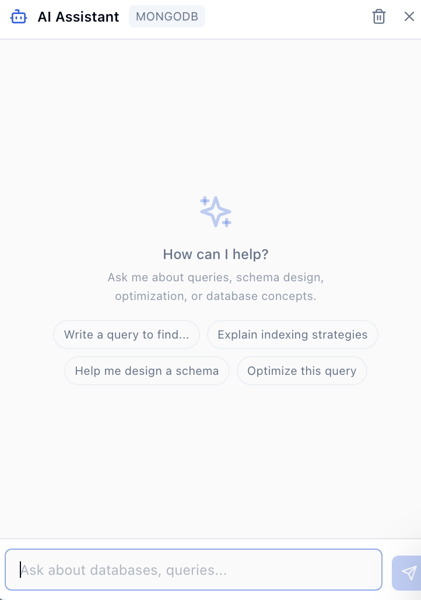
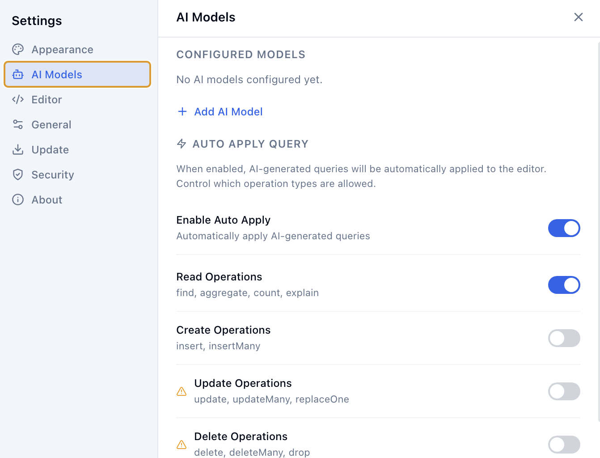
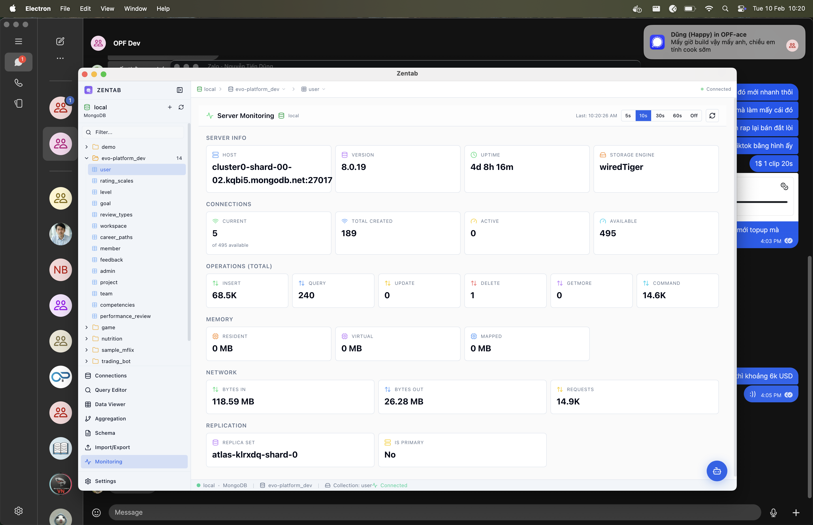

<p align="center">
  
</p>

<h1 align="center">Zentab</h1>

<p align="center">
  <strong>A modern, all-in-one database GUI client for developers</strong><br/>
  Manage MongoDB, PostgreSQL, Redis & Kafka — all from a single, beautiful desktop app.
</p>

<p align="center">
  
  
  
  
  
</p>

---

## 📸 Screenshots

### Connection Management
> Organize connections by type — NoSQL, SQL, Stream & Cache — with SSH Tunnel & SASL/SSL support.



### Data Viewer
> Browse, search, and edit data with Table, Tree, and JSON views. Inline editing, pagination, and advanced filtering.



### Data Management
> Create, update, delete documents/rows with a powerful editor. Import & export in JSON, CSV formats.



### Schema Analyzer
> Auto-detect collection schemas, visualize field types, and get structural insights at a glance.



### AI Assistant
> Chat with AI to generate queries, explain data, and get database advice. Supports DeepSeek, OpenAI, Google Gemini, and custom providers.



### AI Settings
> Configure multiple AI models, set API keys, and choose your preferred provider.



### Real-time Monitoring
> Live server stats dashboard for MongoDB, PostgreSQL, and Redis — connections, memory, operations, replication, and more.



---

## ✨ Features

### 🗄️ Multi-Database Support
| Database | Features |
|----------|----------|
| **MongoDB** | Query Editor, Aggregation Pipeline, Schema Analyzer, Index Management, Explain Plan |
| **PostgreSQL** | SQL Editor, Table Management, Index Management, Server Stats |
| **Redis** | Key Browser, Streams, Pub/Sub, Slow Log, Client List, Bulk Operations, TTL Management |
| **Kafka** | Topic Management, Produce & Consume Messages, Consumer Groups, Topic Config, Partition Details |

### 🔗 Connection Management
- Connection grouping by type (NoSQL, SQL, Stream & Cache)
- SSH Tunnel support (password & private key authentication)
- Kafka SASL/SSL (PLAIN, SCRAM-SHA-256, SCRAM-SHA-512)
- Connection clone, import & export

### 📝 Query Editor
- Multi-tab query editor with Monaco Editor
- IntelliSense autocomplete for collections, fields, and operators
- Query history & saved query templates
- Explain Plan visualizer

### 🤖 AI Assistant
- Natural language → database query conversion
- Streaming chat with context-aware responses
- Support for DeepSeek, OpenAI GPT, Google Gemini, and custom OpenAI-compatible providers

### 📊 Data Visualization
- Interactive charts (Bar, Line, Pie, Area, Scatter)
- JSON Tree View with expand/collapse
- Advanced Data Table with sorting, filtering, and column resizing
- Diff Viewer for comparing documents

### 🔒 Security
- **Electron safeStorage** encryption for all sensitive data (passwords, SSH keys, SASL credentials, 2FA secrets)
- **Two-Factor Authentication (2FA)** with TOTP & QR code
- Idle timeout auto-lock
- OS-level encryption (Keychain on macOS, DPAPI on Windows, libsecret on Linux)

### 📈 Monitoring & Tools
- Real-time server monitoring dashboards (MongoDB, PostgreSQL, Redis)
- Kafka cluster monitoring (brokers, partitions, consumer groups)
- Redis Slow Log, Client List, Memory Analysis
- Batch operations & bulk key management

---

## 🛠️ Tech Stack

| Layer | Technology |
|-------|-----------|
| **Frontend** | React 18, TypeScript, Tailwind CSS, Shadcn/ui |
| **Desktop** | Electron 28 |
| **Editor** | Monaco Editor |
| **State** | Zustand, TanStack Query |
| **Charts** | Recharts |
| **Build** | Vite 5 |
| **Local Storage** | better-sqlite3 (SQLite) |
| **Drivers** | mongodb, pg, ioredis, kafkajs, ssh2 |
| **Security** | Electron safeStorage, otpauth (TOTP), qrcode |
| **Auto-Update** | electron-updater |

---

## 🚀 Getting Started

### Prerequisites

- Node.js 18+
- npm

### Installation

```bash
# Clone the repository
git clone https://github.com/minhbeso/zentab.git
cd zentab

# Install dependencies
npm install

# Run in development mode
npm run electron:dev
```

### Build for Production

```bash
# Build for current platform
npm run build

# Build for Windows
npm run build:win

# Build for macOS
npm run build:mac

# Build for Linux
npm run build:linux
```

---

## 📁 Project Structure

```
zentab/
├── electron/           # Electron main process (IPC handlers, DB drivers)
│   ├── main.ts         # App entry point
│   ├── storage.ts      # SQLite storage with safeStorage encryption
│   ├── mongodb.ts      # MongoDB driver
│   ├── postgresql.ts   # PostgreSQL driver
│   ├── redis.ts        # Redis driver
│   ├── kafka.ts        # Kafka driver
│   └── ssh-tunnel.ts   # SSH tunnel manager
├── src/                # React application
│   ├── components/     # Reusable UI components
│   ├── features/       # Feature modules (query-editor, monitoring, kafka-tools, redis-tools...)
│   ├── services/       # Service layer (database, AI, kafka, redis...)
│   ├── store/          # Zustand state management
│   └── types/          # TypeScript type definitions
├── public/             # Static assets & example screenshots
└── package.json
```

---


